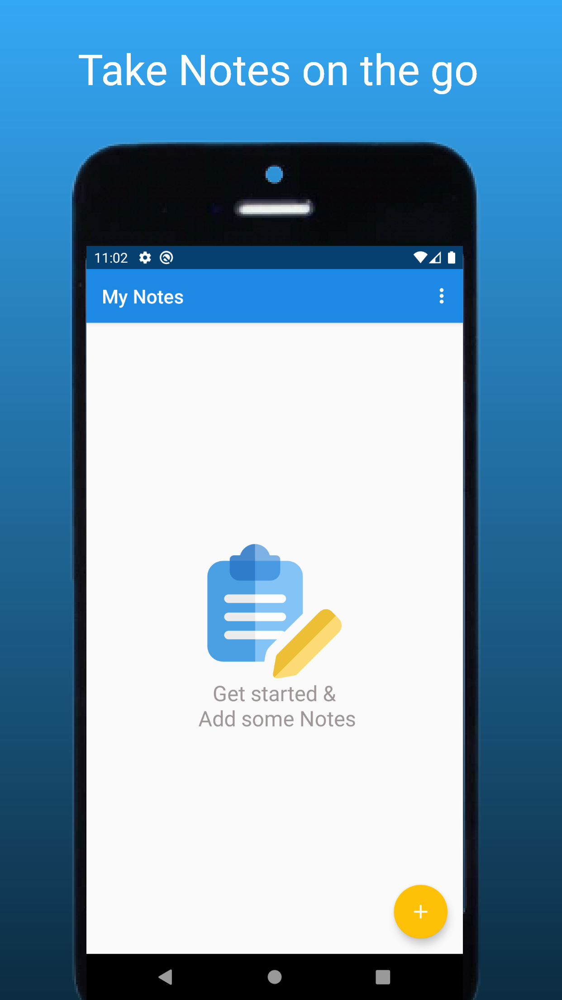
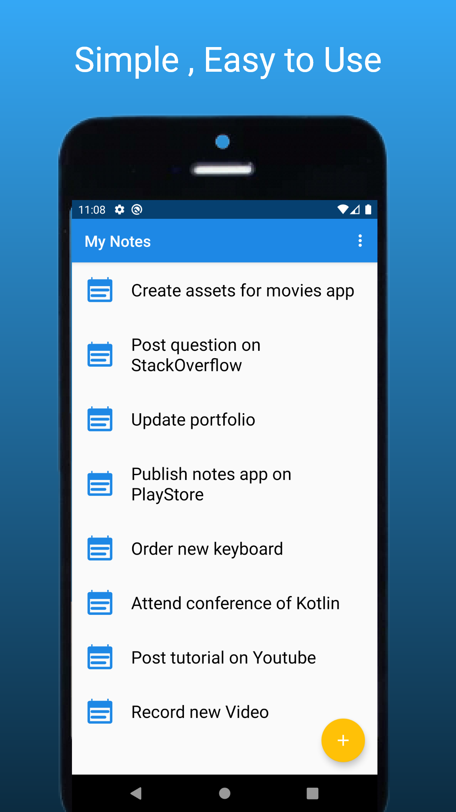
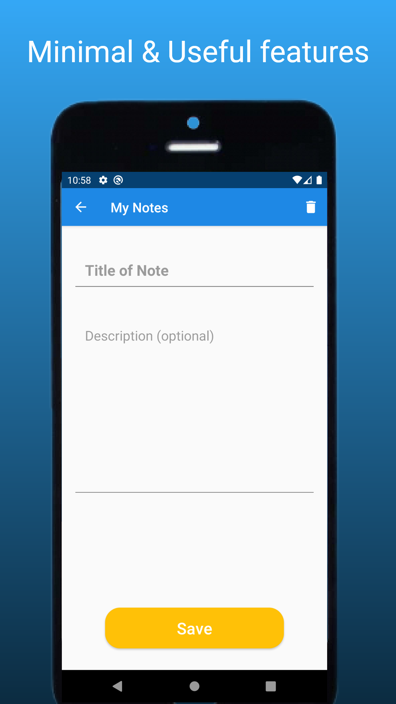
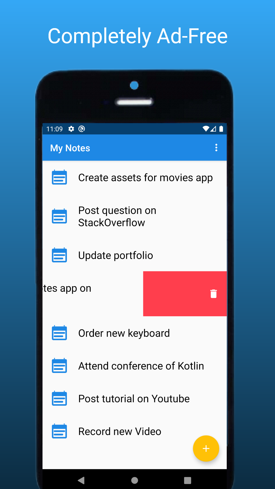

# Simple Notes App

<h2 style="">Description</h2>

<b>My Notes App</b>  is a simple & efficient solution for your Note storing needs 

___
## USP
##### Most phones nowadays come with built-in Notes App. But it is loaded with tons of features that you barely use.</h6>
##### That's why I have designed this simple yet efficient tool specially for you.
___

# Intructions for Open Source Contribution
1. Fork this repo in your github account
2. Then Clone this repo in your local machine 
`git clone https://github.com/<your_user_name>/MyNotesApp.git`
Or in Android Studio click option Get From Version control & fetch it directly
3. Create your own branch for specific issue
4. Solve the issue & test app thoroughly
5. Commit, Push in your repo
6. Create a PR on https://github.com/DSC-DYPCOE/MyNotesApp/pulls
7. Include supporting photos videos if any and explain how you solved the issue in comment of PR

## Contact me:
Portfolio Website: [adarsh45.github.io](https://adarsh45.github.io)
Email: [shete.adarsh@gmail.com](shete.adarsh@gmail.com)
LinkedIn: [linkedin.com/adarsh45](https://www.linkedin.com/in/adarsh45/)
